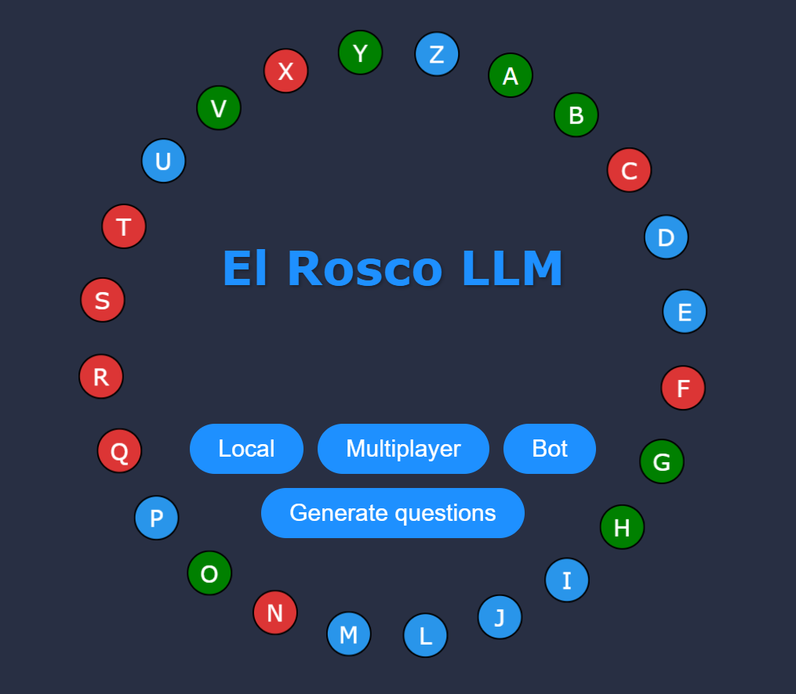
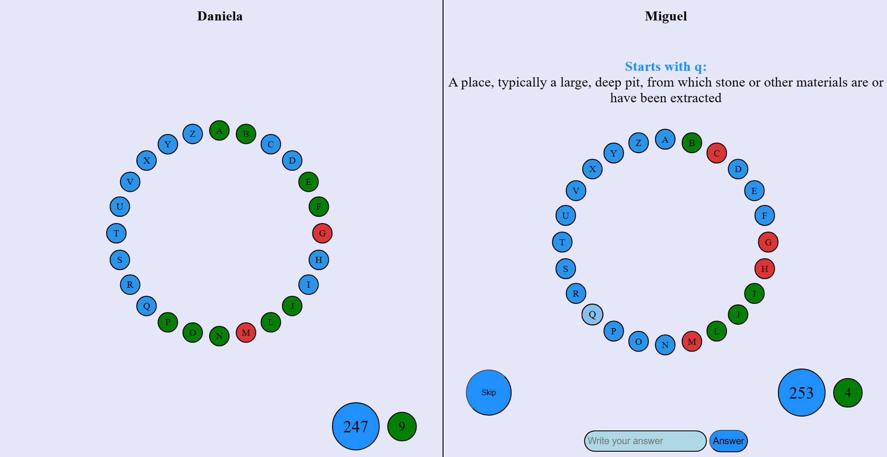
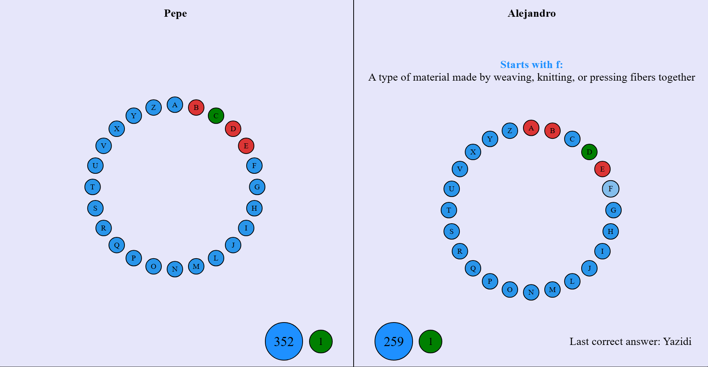
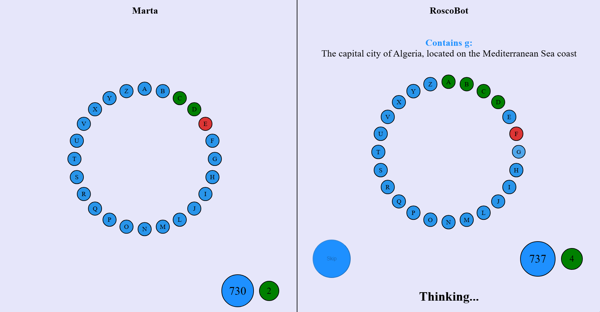
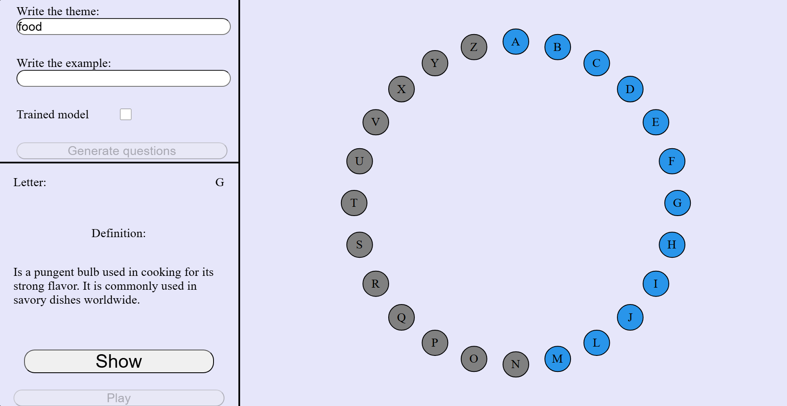

# Readme - El Rosco LLM

## Descripción

Este proyecto, denominado "El Rosco LLM", tiene como objetivo desarrollar un sistema que implemente la fase final del programa Pasapalabra, emitido actualmente por Antena 3. Para ello, se empleará un LLM (ChatGPT), que generará preguntas y determinará si las respuestas dadas son correctas o no.

## Equipo

- Alejandro Vallejos Entrena (GII)
- Iker Cuenca Bustamante (GII)
- Alejandro Tobías Ángeles (GII)
- Daniela Vidal León (GII)

## Director

Dirigido por: Manuel Núñez García

## Objetivo

El sistema desarrollado permitirá jugar tanto a personas como a otros LLMs. La idea principal es que el LLM genere preguntas basadas en diferentes categorías, correspondientes a las letras del abecedario, y determine si las respuestas proporcionadas son correctas.

## Tecnologías

El sistema estará basado en tecnologías de procesamiento de lenguaje natural (NLP) y, en particular, en el uso de LLMs. Además, para la implementación de la interfaz de usuario, se utilizará React, una biblioteca de JavaScript ampliamente utilizada para construir interfaces de usuario interactivas y reutilizables. Se emplearán también otras herramientas de programación adecuadas para desarrollar la lógica del juego y la interacción con los jugadores.

<h1> Instalación del proyecto </h1>

> [!NOTE]
> Para poder usar este proyecto se debe pedir acceso a las claves a las que hace referencia el archivo .env

<h3> Prerrequisitos </h3>

- git
- Node
- npm

Git será útil para descargar el repositorio con el codigo fuente del proyecto. La guía de instalación puede consultarse en https://git-scm.com/
Node es un entorno de ejecución de JavaScript. Será necesario para ejecutar el código de la aplicación. En caso de no tener Node.js instalado referirse a esta guía https://nodejs.org/en/download/package-manager, instalar la versión v21.6.1. npm es el administrador de paquetes de Node, hará falta para poder instalar las dependencias utilizadas en la aplicación. 

Ha de tenerse en cuenta que en todo momento será necesaria la conexión a internet, ya que la aplicación utiliza llamdas a servicios de terceros y apis externas. 

Una vez satisfechos los anteriores requisitos, habrá que hacer lo siguiente para instalar todo el proyecto y ponerlo en uso. 
	
<h2> Servidor </h2> 

Para descargar el código fuente, en caso de no tenerlo ya, puede introducirse el siguiente comando en una terminal (para ello es necesario tener acceso al repositorio de Github): 

	git clone git@github.com:Dai-vl/el-rosco-llm.git
 	cd el-rosco-llm

Una vez instalado deben ejecutarse los siguientes comandos:

 	cd backend
	npm install 

<h3>  Ejecución del servidor </h3> 

Estos comandos instalan las dependencias que se usan en el servidor. La ejecución de la aplicación debe realizarse de la siguiente manera:

	npm run dev

Ahora las api del servidor se encuentra levantada. Desde este momento el cliente podrá conectarse al backend para hacer las llamadas pertinentes por socket e interfaz.

<h3>  Generación de preguntas </h3>  

La generación de preguntas es un proceso que implica varias inteligencias artificiales. Para poder usarlo debe tenerse instalado llama3 a través del cliente de ollama. La instalación de ollama se explica en esta guía https://ollama.com/download. Una vez descargado se debe instalar llama3, con el siguiente comando
	
	ollama run llama3

Para comenzar el servicio de generación de preguntas debe ejecutarse el siguiente comando desde el backend:

	node services/generacionPreguntas/generateQuestions.js

En la terminal podrá verse el como avanza el proceso de generación de preguntas. 

<h2> Cliente </h2>

El código del cliente se encuentra en frontend. Para acceder estando desde el backend:
	
 	cd ../frontend

Debe ejecutarse el siguiente comando: 

	npm install

Desde este momento podrá iniciarse la aplicación (importante que el servidor esté arrancado en la misma máquina) con este comando:

	npm run dev

<h1> Modos de juego </h1>

	

<h3> Local </h3>

El modo de juego local permite a dos jugadores jugar en la misma máquina. Para ello, uno de los jugadores deberá seleccionar la opción de jugar en local y tras introducir los nombres comenzará la partida. 

	

<h3> Multijugador </h3>

El modo de juego multijugador permite a dos jugadores jugar en máquinas distintas. Para ello, uno de los jugadores deberá crear una sala que tendrá asociada un código. El otro jugador deberá unirse con ese código. 

En el proceso de ejecución aquí descrito, el servidor permanece en local en la máquina desde la que se ejecute, por lo que si se quiere probar este modo debe ser desde la misma máquina en pestañas o navegadores distintos. Actualmente el servidor remoto no está abierto ya que dificulta el proceso de entrega, por lo que hemos decidido dejarlo en local para la comodidad de quién lo quiera probar.

	

<h3> VS IA </h3>

El modo de juego contra la IA permite a un jugador jugar contra una inteligencia artificial. Para ello, el jugador deberá seleccionar la opción de jugar contra la IA y tras introducir su nombre comenzará la partida.

	

<h3> Rosco temático </h3>

El modo de juego del rosco temático permite a un jugador generar un rosco basado en una temática. Para ello, el jugador deberá seleccionar la opción de jugar el rosco temático y tras introducir su nombre y la temática, se generará la ronda de preguntas y comenzará la partida.

Hay dos opciones, usar el modelo entrenado (seleccionando "Trained model") o usando la api si no se selecciona esta opción. Por otro lado, las preguntas que se van generando se pueden ver seleccionando aquellas que están en azul, estas aparecerán en el recuadro de abajo a la izquierda. Además, se puede ver la solcuión seleccionando "Show". Una vez generado por completo, se puede seleccionar "Play" para jugar con ellas en el Rosco.

	

<h2> Notebooks </h2>

En caso de querer ejecutar los notebooks para ver los resultados y algunas de las conclusiones de la precisión de los modelos, usar el siguiente comando:

	cd bots_modeling

En este directorio se encuentra un readme con la información correspondiente al modelado, análisis y datos empleados.

> [!NOTE]
> Para obtener información específica sobre el proyecto, consultar la documentación en la memoria del proyecto
